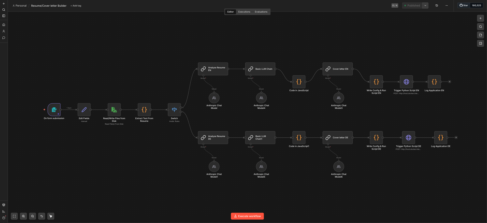

# 🚀 Job Application Automation

An n8n-based automation that takes you from "found a job" to "ready to apply" in 60 seconds — generating tailored resumes and cover letters in English or German, converting to PDF, scrubbing metadata, and logging every application.



---

## What It Does

1. You fill in a simple form: job title, company name, job description, language
2. The automation:
   - Reads your resume from disk
   - Analyses the JD vs your resume (ATS keyword scoring)
   - Tailors 3 resume bullet points to match JD language
   - Generates a cover letter in your exact voice (EN or DE)
   - Creates DOCX files with UTM-tracked portfolio hyperlinks
   - Converts to PDF via LibreOffice
   - Scrubs PDF metadata (no AI fingerprints)
   - Saves everything to an organised folder with date prefix
   - Logs the application to a CSV with ATS scores

**Total time: ~60 seconds per application**

---

## Why UTM Tracking on Job Applications?

One of the biggest frustrations in job searching is the black box — you send your resume and never know what happens next. Did the recruiter even open it? Did they visit your portfolio?

This automation adds UTM parameters to every portfolio link in your resume and cover letter:
```
https://yourportfolio.com/?utm_source=resume-english&utm_medium=pdf&utm_term=company-name
```

This means if a recruiter clicks your portfolio link from your resume, you can see it in Google Analytics or any analytics tool:

- **Which company** visited (utm_term = company slug)
- **Which document** they came from (resume vs cover letter)
- **Which language version** they read (English vs German)

### What this tells you

| Signal | What it means |
|---|---|
| Resume click, no response | They looked but weren't interested enough to reply |
| Cover letter click | They read your cover letter carefully |
| Multiple visits | Strong interest — follow up |
| No clicks | Resume may not have been opened at all |

This won't tell you everything — but it gives you real signal in a process that normally gives you none. Over time you can see patterns: which roles get more portfolio visits, which companies engage more, and whether your resume is actually being read.

**Privacy note:** This only tracks clicks on your own portfolio website. No data is collected from recruiters without their knowledge — they simply click a link like any other.

---

## Analytics Setup

To actually see the UTM data, you need an analytics tool on your portfolio website.

### Recommended: Umami Analytics

This project was built with [Umami](https://umami.is) in mind — it's:
- **GDPR compliant** — no cookies, no personal data collection
- **Open source** — self-host for free or use their cloud
- **Privacy-first** — you own your data
- **Lightweight** — one script tag on your website

Once installed, you'll see UTM campaigns in Umami under **Sources** → **Campaigns**.

### Other privacy-friendly alternatives

- [Plausible](https://plausible.io) — simple, GDPR compliant, paid
- [Matomo](https://matomo.org) — self-hostable, full-featured
- [Fathom](https://usefathom.com) — simple, privacy-first, paid
- Google Analytics — works but not privacy-first

### Important: Data & Privacy Notice

If you deploy this automation and collect any analytics data:

> ⚠️ **You are responsible for complying with applicable privacy laws (GDPR, CCPA, etc.) in your region.**
>
> - Only collect data you actually need
> - If your portfolio collects visitor data beyond basic analytics, declare it in a privacy policy
> - UTM parameters in this project only track clicks originating from your own documents — no data is collected from recruiters beyond standard website analytics
> - Self-hosting Umami or Plausible means data stays on your server and is not shared with third parties

---
## Prerequisites

| Tool | Purpose | Install |
|---|---|---|
| [n8n](https://n8n.io) (self-hosted) | Workflow engine | `docker run -d --name n8n -p 5678:5678 docker.n8n.io/n8nio/n8n` |
| [Python 3](https://python.org) | DOCX creation & PDF conversion | Homebrew or Anaconda |
| [LibreOffice](https://libreoffice.org) | Headless PDF conversion | `brew install --cask libreoffice` |
| [ExifTool](https://exiftool.org) | PDF metadata scrubbing | `brew install exiftool` |
| [Flask](https://flask.palletsprojects.com) | Local webhook server | `pip install flask` |
| [python-docx](https://python-docx.readthedocs.io) | DOCX manipulation | `pip install python-docx` |
| [Anthropic API key](https://console.anthropic.com) | Claude AI for content generation | Sign up at console.anthropic.com |

---

## Installation

### 1. Clone the repo

```bash
git clone https://github.com/YOUR_USERNAME/job-application-automation.git
cd job-application-automation
```

### 2. Install Python dependencies

```bash
pip install flask python-docx
```

### 3. Install system tools (macOS)

```bash
brew install --cask libreoffice
brew install exiftool
```

### 4. Set up your resume files

Create a folder for your resume files:

```bash
mkdir ~/.n8n-files
```

Copy your resume DOCX files:
```bash
cp your-resume-EN.docx ~/.n8n-files/Resume-EN.docx
cp your-resume-DE.docx ~/.n8n-files/Resume-DE.docx
```

### 5. Configure the Python script

Open `scripts/apply_changes.py` and update:

```python
# Line ~189 - update paths to match your resume files
source_resume = '/Users/YOUR_USERNAME/.n8n-files/Resume-EN.docx'

# Line ~196 - update output directory
outputDir: '/Users/YOUR_USERNAME/Desktop/JobApplications/' + fileBase
```

Also update your portfolio domain:
```python
# Replace all instances of 'yourdomain.com' with your actual domain
```

### 6. Start the webhook server

```bash
python3 scripts/webhook_server.py
```

To auto-start on Mac boot, create a LaunchAgent:

```bash
cat > ~/Library/LaunchAgents/com.jobautomation.webhook.plist << 'EOF'
<?xml version="1.0" encoding="UTF-8"?>
<!DOCTYPE plist PUBLIC "-//Apple//DTD PLIST 1.0//EN" "http://www.apple.com/DTDs/PropertyList-1.0.dtd">
<plist version="1.0">
<dict>
    <key>Label</key>
    <string>com.jobautomation.webhook</string>
    <key>ProgramArguments</key>
    <array>
        <string>/usr/local/bin/python3</string>
        <string>/PATH/TO/scripts/webhook_server.py</string>
    </array>
    <key>RunAtLoad</key>
    <true/>
    <key>KeepAlive</key>
    <true/>
</dict>
</plist>
EOF

launchctl load ~/Library/LaunchAgents/com.jobautomation.webhook.plist
```

### 7. Set up n8n

**Start n8n with the required mounts:**

```bash
docker run -d \
  --name n8n \
  -p 5678:5678 \
  -v ~/.n8n:/home/node/.n8n \
  -v ~/.n8n-files:/home/node/.n8n-files \
  -e N8N_ENFORCE_SETTINGS_FILE_PERMISSIONS=false \
  -e NODE_FUNCTION_ALLOW_EXTERNAL=mammoth \
  -e NODE_FUNCTION_ALLOW_BUILTIN=fs,path,child_process \
  docker.n8n.io/n8nio/n8n
```

**Import the workflow:**
1. Open `http://localhost:5678`
2. Go to **Workflows** → **Import**
3. Upload `n8n/workflow.json`

**Add your Claude API key:**
1. Go to **Settings** → **Credentials**
2. Add a Header Auth credential named `Claude API`
3. Header Name: `x-api-key`
4. Header Value: your Anthropic API key

**Install mammoth inside Docker:**
```bash
docker exec -u root n8n npm install -g mammoth
```

---

## Configuration

### Update the prompts for your profile

In n8n, open these nodes and update the system prompts with your details:

**Analyse Resume EN / DE nodes:**
- Replace candidate profile details with your own background
- Update the skills list to match your actual skills
- Keep the output format instructions unchanged

**Cover Letter EN / DE nodes:**
- Update contact information (name, email, phone, LinkedIn)
- Update portfolio domain
- Adjust tone and style examples to match your writing

**Write Config nodes:**
- Update output directory path
- Update portfolio URL for UTM tracking

### UTM Tracking

The automation automatically builds UTM URLs for your portfolio links:

| Document | utm_source |
|---|---|
| English Resume | `resume-english` |
| German Resume | `lebenslauf-deutsch` |
| English Cover Letter | `cover-letter-english` |
| German Cover Letter | `anschreiben-deutsch` |

All use `utm_medium=pdf` and `utm_term=[company-slug]`

---

## Usage

1. Open `http://localhost:5678` (or your custom domain)
2. Go to your workflow → click the Form Trigger node → copy the **Production URL**
3. Bookmark that URL
4. When you find a job:
   - Open the bookmarked form
   - Fill in: Job Title, Company Name, Job Description, Language
   - Submit
   - Wait ~60 seconds
   - Find your files in `Desktop/JobApplications/`

### Output files

```
Desktop/JobApplications/
  └── 20260322_Dogra_Akshun_CompanyName_JobTitle/
        ├── 20260322_..._Resume_EN.docx
        ├── 20260322_..._Resume_EN.pdf       ← Send this
        ├── 20260322_..._CoverLetter_EN.docx
        └── 20260322_..._CoverLetter_EN.pdf  ← Send this
```

### Application log

Every application is logged to:
```
~/.n8n-files/applications_log.csv
```

With columns: Date, Company, Job Title, Language, ATS Before, ATS After

---

## Cost

Each full run (resume analysis + cover letter) uses ~4,000-7,000 tokens.

| Model | Cost per application |
|---|---|
| Claude Sonnet 4.6 | ~$0.02-0.04 |

$10 in API credits ≈ 250-500 job applications.

---

## Architecture

```
[n8n Form Trigger]
      ↓
[Edit Fields - Build UTMs]
      ↓
[Read Resume from Disk]
      ↓
[Extract Text - mammoth]
      ↓
[Switch - Language Router]
   EN ↓                    DE ↓
[Analyse Resume EN]    [Analyse Resume DE]
      ↓                        ↓
[Tailor Resume EN]     [Tailor Resume DE]
      ↓                        ↓
[Parse Changes EN]     [Parse Changes DE]
      ↓                        ↓
[Cover Letter EN]      [Cover Letter DE]
      ↓                        ↓
[Write Config EN]      [Write Config DE]
      ↓                        ↓
[Webhook → Python]     [Webhook → Python]
      ↓                        ↓
   apply_changes.py creates:
   - Tailored Resume DOCX
   - Cover Letter DOCX
   - PDF conversion (LibreOffice)
   - Metadata scrubbing (ExifTool)
      ↓
[Log to CSV]
```

---

## Security & Privacy

- **No cloud storage** — all files stay on your local machine
- **Metadata scrubbed** — PDFs show Microsoft Word as creator, not AI tools
- **API key** — stored in n8n credentials, never in workflow JSON
- **Resume data** — stored locally, never sent to third parties except Anthropic API for content generation

---

## Contributing

Pull requests welcome! Some ideas for improvements:
- LinkedIn URL UTM tracking
- Email notification when files are ready
- ATS score visualization dashboard
- Support for more languages
- Integration with job boards (LinkedIn, Indeed)

---

## License

MIT License — free to use, modify and distribute.

---

## Credits

Built with:
- [n8n](https://n8n.io) — workflow automation
- [Claude](https://anthropic.com) — AI content generation
- [python-docx](https://python-docx.readthedocs.io) — DOCX manipulation
- [LibreOffice](https://libreoffice.org) — PDF conversion
- [ExifTool](https://exiftool.org) — metadata management
